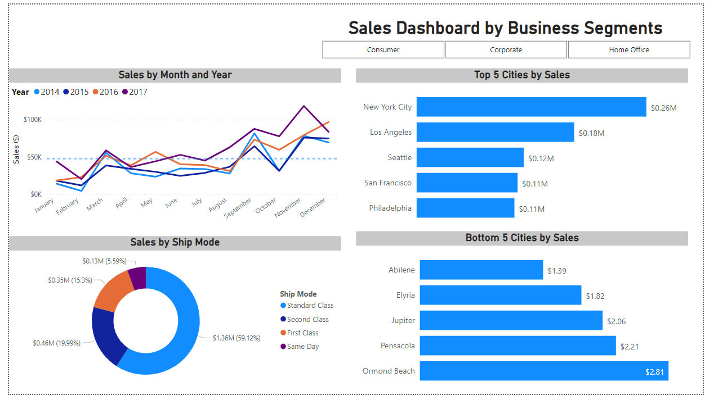
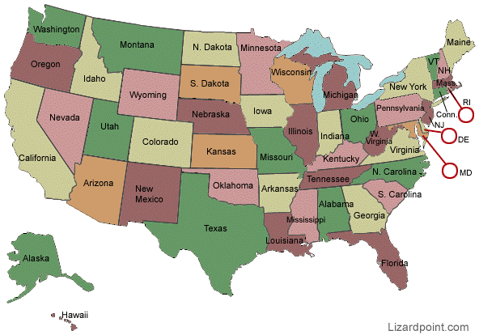
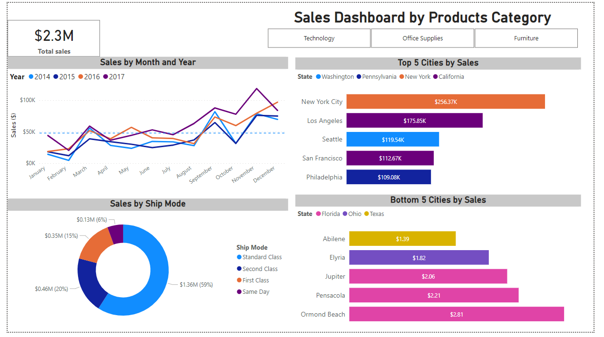
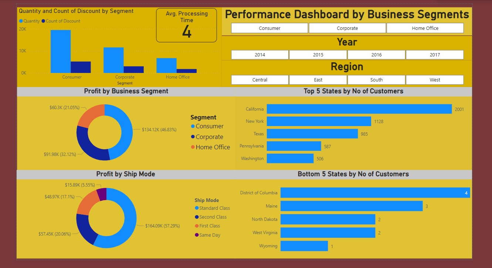

# Super Store Analysis Dashboard

## Introduction
The aim of this project is to explore super store sales activities and generate data driven insights that can help in taking business decisions for better service delivery and turnover using Power BI.

The report consists of three (3) pages:

•	Analysis by business categories

•	Analysis by business segment

•	Analysis by profit/customer distribution

**_Disclaimer_**: _the data set and report do not represent any company. Its just a dummy data to experiment on Power BI._

## Problem Statement
•	What is the pattern of sales across the months yearly, does sales pattern varies yearly?

•	Which of the shipping mode does most client frequently uses, which one can be scraped or enhanced

•	Which top 5 cities do we have most patronage/sales, how can we improve services to them

•	Which bottom 5 cities do we have least sales, how can we improve patronage

•	Which product category has the highest and least sales

•	Ask similar questions using business segments.

•	What are the top 5 states with the highest and least customers in order to strategize on distribution networks.

•	Understand the regional distribution of customers and how it varies year by year.

•	How is the profit accrued by business segment.

•	Which shipping mode offers the largest percentage profit.

•	Is there any correlation between quantity shipped and discount in order to know how to modify the incentive.

•	Any other data driven insight identified.

## Skills demonstrated
•	DAX, filters, tooltip, Quick measure, cards

## Data Sourcing
•	The data was obtained from a side hustle bootcamp I attended in 2020 to practice with

•	It has only one sheet, 17 features/columns and 9,994 rows

## Data Transformation
The data is effectively transformed and cleaned with power query editor in Power BI such as:

•	Making first row as header.

•	Using DAX function to transform the date columns into days format 

•	Creation of a new column for processing time in days

•	processing time = DATEDIFF(Orders[Order Date],Orders[Ship Date],DAY)

•	Obtained total sales using the DAX function: Total sales = SUM(Orders[Sales])

## Modelling
No modelling was required as just one tables was used 

## Analysis and visualisation

•	The dashboard below showed similar patterns of sales across the four (4) year sales review with lowest sales recorded in January and highest in November except in 2016 with highest in December. 

•	There is gradual increases in sales across the months till November.

•	The most patronised shipping service is “standard class” with 59% of the sales and least is “same day” with just 6%. 

•	Hence management can decide weather to discontinue “same day” or modify the service.

•	The top 5 state and cities with highest sales are highlighted as well as the 5 lowest sale cities. This can be used to decide on resource allocation for incentives and advertisement.

•	Product categories technology recorded the highest sales at $836.15K then furniture and office supplies respectively. With this the inventory can plan to restock effectively while strategy to increasing sales of other items can be planned.

•	In terms of customer base, the store has its highest customer base from California and least from Wyoming. The management can investigate causes of low customers in Wyoming and strategy to improve the customer base in the 5 lowest states.

•	The average processing time is 4 days. Strategy to reduce it to 3 days can be worked on.

•	The dashboard also shows strong correlation between quantity of sales and discount. Hence discount can be reviewed to subsequently increase sales.

•	Among the three (3) business segments, highest profit is recorded from consumer goods and least from home office items. Besides, standard shipping mode also offers the highest profit.

## Conclusion and recommendations

•	Sales increases from January progressively towards November. Restocking can be planned towards July in preparation for the peak November sales. 

•	“Standard class” shipping mode should be retained while “same day” mode can be scraped or revised.

•	Reasons for low sales in the least 5 states should be investigated and strengthened accordingly e.g. through aggressive advert and incentives to increase customer base.

•	Reducing processing time has the potential to increase sales and customer base, a review of processing time to 3 days would be a good idea.

•	A forward review of discount plan might help increase sales volume.

